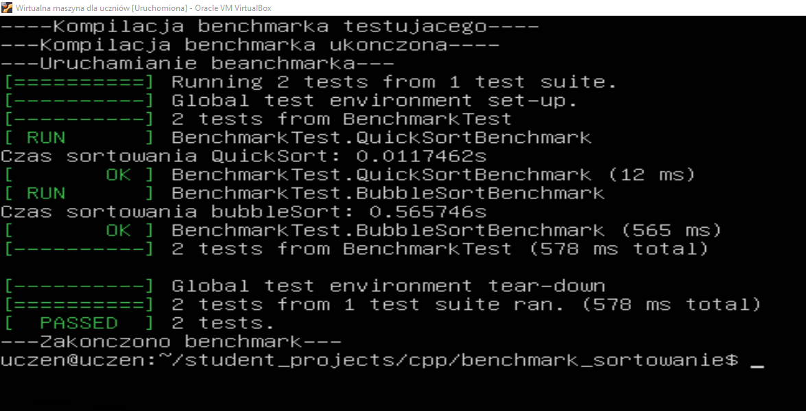

# Dokumentacja Testów Wydajności Sortowania

## Wprowadzenie

Celem przeprowadzonych testów jest porównanie wydajności dwóch algorytmów sortujących: **Bubble Sort** i **Quick Sort**. Testy mierzą czas wykonania sortowania dla losowo wygenerowanych wektorów zawierających 10,000 elementów.

## Wymagania

- **C++11 lub nowszy**: Użycie nowoczesnych funkcji i kontenerów STL.
- **Google Test**: Framework do testowania jednostkowego w C++.

## Algorytmy

1. **Bubble Sort**:
   - Algorytm prosty, ale nieefektywny dla dużych zbiorów danych.
   - W przypadku sortowania bąbelkowego czas działania wynosi O(n²) w najgorszym przypadku.

2. **Quick Sort**:
   - Algorytm dziel i zwyciężaj.
   - Osiąga czas działania O(n log n) w przeciętnym przypadku, co czyni go znacznie bardziej efektywnym niż Bubble Sort.

## Opis Testów

### 1. Test Wydajności Quick Sort

**Opis**: Mierzy czas sortowania przy użyciu algorytmu Quick Sort.

- **Przygotowanie**: Generowanie wektora o rozmiarze 10,000 z losowymi liczbami całkowitymi.
- **Pomiar czasu**: Użycie `std::chrono` do pomiaru czasu wykonania sortowania.
- **Wynik**: Czas sortowania jest wyświetlany w sekundach.

### 2. Test Wydajności Bubble Sort

**Opis**: Mierzy czas sortowania przy użyciu algorytmu Bubble Sort.

- **Przygotowanie**: Generowanie wektora o rozmiarze 10,000 z losowymi liczbami całkowitymi.
- **Pomiar czasu**: Użycie `std::chrono` do pomiaru czasu wykonania sortowania.
- **Wynik**: Czas sortowania jest wyświetlany w sekundach.

### 3. Wyniki testów



## Przykładowy Kod Testów

Poniżej przedstawiono przykładowy kod do przeprowadzenia testów wydajności dla obu algorytmów:

```cpp
#include <iostream>
#include <vector>
#include <algorithm>
#include <ctime>
#include "gtest/gtest.h"
#include <chrono>

using namespace std;

// Funkcja sortująca wektor za pomocą BubbleSort
void bubbleSort(vector<int>& vec) {
    int n = vec.size();
    bool swapped;
    
    for(int i = 0; i < n - 1; i++) {
        swapped = false;
        
        for(int j = 0; j < n - i - 1; j++) {
            if(vec[j] > vec[j + 1]) {
                swap(vec[j], vec[j + 1]);
                swapped = true;
            }
        }
        if(!swapped) break;
    }
}

// Funkcja sortująca wektor za pomocą QuickSort
void quickSort(std::vector<int>& vec) {
    if (vec.size() <= 1) return;
    int pivot = vec[vec.size() / 2];
    std::vector<int> left, right;
    for (size_t i = 0; i < vec.size(); i++) {
        if (vec[i] < pivot) left.push_back(vec[i]);
        else if (vec[i] > pivot) right.push_back(vec[i]);
    }
    quickSort(left);
    quickSort(right);
    vec.clear();
    vec.insert(vec.end(), left.begin(), left.end());
    vec.push_back(pivot);
    vec.insert(vec.end(), right.begin(), right.end());
}

// Test wydajności sortowania QuickSort
TEST(BenchmarkTest, QuickSortBenchmark) {
    std::vector<int> vec(10000);
    std::srand(std::time(0)); 
    std::generate(vec.begin(), vec.end(), std::rand);

    auto start = std::chrono::high_resolution_clock::now();
    quickSort(vec);
    auto end = std::chrono::high_resolution_clock::now();
    std::chrono::duration<double> elapsed_seconds = end - start;

    std::cout << "Czas sortowania QuickSort: " << elapsed_seconds.count() << "s\n";
}

// Test wydajności sortowania BubbleSort
TEST(BenchmarkTest, BubbleSortBenchmark) {
    std::vector<int> vec(10000);
    std::srand(std::time(0)); 
    std::generate(vec.begin(), vec.end(), std::rand);

    auto start = std::chrono::high_resolution_clock::now();
    bubbleSort(vec);
    auto end = std::chrono::high_resolution_clock::now();
    std::chrono::duration<double> elapsed_seconds = end - start;

    std::cout << "Czas sortowania BubbleSort: " << elapsed_seconds.count() << "s\n";
}

int main(int argc, char **argv) {
    ::testing::InitGoogleTest(&argc, argv);
    return RUN_ALL_TESTS();
}
