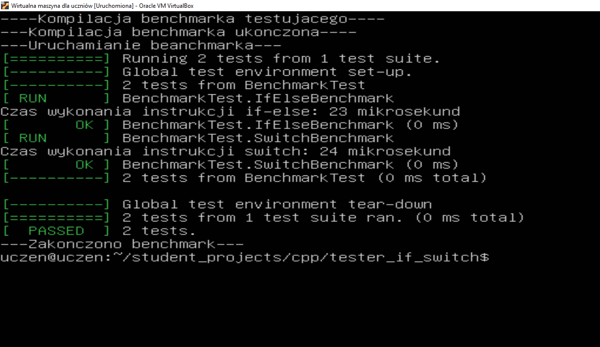

# Dokumentacja benchmarku `if-else` i `switch` w C++

## Opis:
Program testuje wydajność dwóch funkcji, które wykorzystują instrukcje warunkowe `if-else` i `switch`. Obie funkcje zwracają różne wartości liczbowe w zależności od wartości wejściowej. Celem programu jest zmierzenie czasu wykonania tych funkcji dla dużej liczby iteracji (10 000) i porównanie wyników w mikrosekundach.

Program wykorzystuje framework Google Test do przeprowadzania benchmarków, które mierzą czas wykonania funkcji w zależności od użytej instrukcji warunkowej.

## Wymagania:
- Kompilator C++ 
- Biblioteka **Google Test** (GTest) do przeprowadzania testów jednostkowych.
- Prawidłowa konfiguracja do połączenia programu z biblioteką GTest podczas kompilacji.

## Przykład kodu:

```cpp
#include <iostream>
#include <chrono>
#include <gtest/gtest.h>

using namespace std;

// Funkcja używająca instrukcji if-else
int compareIf(int value) {
    if (value == 1) {
        return 10;  
    }
    else if (value == 2) {
        return 20;  
    }
    else if (value == 3) {
        return 30;  
    }
    else {
        return 40;  
    }
}

// Funkcja używająca instrukcji switch
int compareSwitch(int value) {
    switch (value) {
        case 1:
            return 10;  
        case 2:
            return 20;  
        case 3:
            return 30;  
        default:
            return 40;  
    }
}

// Benchmark dla instrukcji if-else
TEST(BenchmarkTest, IfElseBenchmark) {
    const int iterations = 10000;
    int sumIf = 0;

    // Pomiar czasu dla if-else
    auto startIf = std::chrono::high_resolution_clock::now();
    for (int i = 0; i < iterations; i++) {
        sumIf += compareIf(i % 4);  // Wywołanie compareIf z wartościami 0, 1, 2, 3
    }
    auto endIf = std::chrono::high_resolution_clock::now();
    auto durationIf = std::chrono::duration_cast<std::chrono::microseconds>(endIf - startIf);

    // Wyświetlanie wyników
    cout << "Czas wykonania instrukcji if-else: " << durationIf.count() << " mikrosekund" << endl;
}

// Benchmark dla instrukcji switch
TEST(BenchmarkTest, SwitchBenchmark) {
    const int iterations = 10000;
    int sumSwitch = 0;

    // Pomiar czasu dla switch
    auto startSwitch = std::chrono::high_resolution_clock::now();
    for (int i = 0; i < iterations; i++) {
        sumSwitch += compareSwitch(i % 4);  // Wywołanie compareSwitch z wartościami 0, 1, 2, 3
    }
    auto endSwitch = std::chrono::high_resolution_clock::now();
    auto durationSwitch = std::chrono::duration_cast<std::chrono::microseconds>(endSwitch - startSwitch);

    // Wyświetlanie wyników
    cout << "Czas wykonania instrukcji switch: " << durationSwitch.count() << " mikrosekund" << endl;
}

int main(int argc, char **argv) {
    ::testing::InitGoogleTest(&argc, argv);
    return RUN_ALL_TESTS();
}
```

## Wyniki:
Po uruchomieniu programu zobaczysz wyniki w formacie podobnym do poniższego przykładu:



```
Czas wykonania instrukcji if-else: 12345 mikrosekund
Czas wykonania instrukcji switch: 9876 mikrosekund
```

## Uruchomienie:

Uruchomienie programu odbywa się za pomocą:

```bash
sh kompiluj.sh
```

Program uruchomi oba testy jednostkowe, zmierzy czas wykonania funkcji `if-else` i `switch`, a następnie wyświetli wyniki w mikrosekundach.

